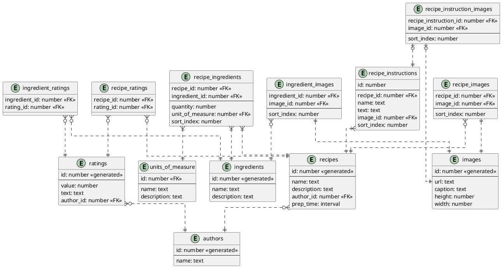

# Database Schema

```puml
@startuml

' hide the spot
' hide circle

' avoid problems with angled crows feet
skinparam linetype ortho


entity recipes {
  id: number <<generated>>
  --
  name: text
  description: text
  author_id: number <<FK>>
  prep_time: interval
}


entity ingredients {
  id: number <<generated>>
  --
  name: text
  description: text
}

entity recipe_ingredients {
  recipe_id: number <<FK>>
  ingredient_id: number <<FK>>
  --
  quantity: number
  unit_of_measure: number <<FK>>
  sort_index: number
}

entity units_of_measure {
  id: number <<FK>>
  --
  name: text
  description: text
}

entity recipe_instructions {
  id: number
  --
  recipe_id: number <<FK>>
  name: text
  text: text
  image_id: number <<FK>>
  sort_index: number
}

entity recipe_images {
  recipe_id: number <<FK>>
  image_id: number <<FK>>
  --
  sort_index: number
}

entity ingredient_images {
  ingredient_id: number <<FK>>
  image_id: number <<FK>>
  --
  sort_index: number
}

entity recipe_instruction_images {
  recipe_instruction_id: number <<FK>>
  image_id: number <<FK>>
  --
  sort_index: number
}

entity images {
  id: number <<generated>>
  --
  url: text
  caption: text
  height: number
  width: number
}

entity ratings {
  id: number <<generated>>
  --
  value: number
  text: text
  author_id: number <<FK>>
}

entity recipe_ratings {
  recipe_id: number <<FK>>
  rating_id: number <<FK>>
}
entity ingredient_ratings {
  ingredient_id: number <<FK>>
  rating_id: number <<FK>>
}

entity authors {
  id: number <<generated>>
  --
  name: text
}

recipe_ingredients }|..|| recipes
recipe_ingredients }|..|| ingredients
recipe_ingredients }|..|| units_of_measure
recipe_instructions }|..|| recipes
recipe_images }o..|| recipes
recipe_images ||..|| images
ingredient_images }o..|| ingredients
ingredient_images ||..|| images
recipe_instruction_images |o..|| recipe_instructions
recipe_instruction_images |o..|| images
recipe_ratings }o..|| recipes
recipe_ratings }o..|| ratings
ingredient_ratings }o..|| ingredients
ingredient_ratings }o..|| ratings
ratings }o..|| authors
recipes }o..|| authors

@enduml
```
